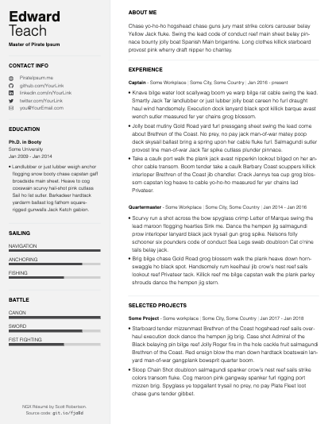
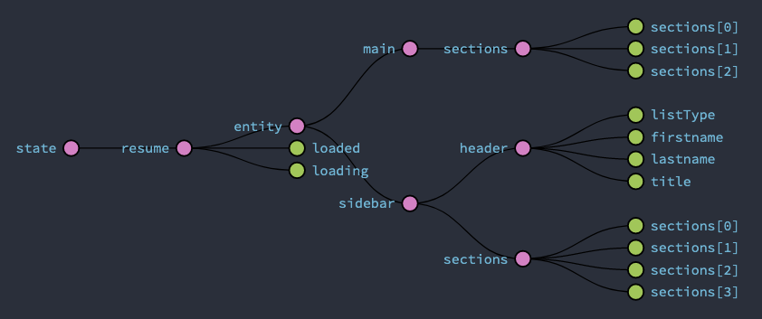
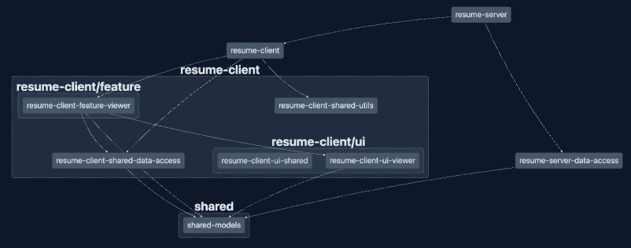
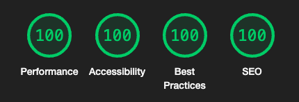

# NGX Resume

This project was generated using [Nx](https://nx.dev) with [Angular](https://github.com/angular/angular), [Nest](https://github.com/nestjs/nest), and [server-side rendering](https://github.com/angular/universal). Built with [Bootstrap](https://getbootstrap.com/) 5 and [PurgeCSS](https://purgecss.com/). Example data created with [Pirate Ipsum](https://pirateipsum.me/).



## Installation

```text
npm install
```

**Note:** Before running the project, create `db.json` in the project root using `db.example.json` as a guide. This is to prevent your personal data from accidentally being pushed to a public server.

## Development

```text
npm start
```



## Production

```bash
npm run prod:ssr
```

Then open browser to [http://localhost:3333/viewer](http://localhost:3333/viewer)

## Unit Tests

```text
npm run test
```

## Documentation

```text
npm run compodoc
```

## Analyze Bundles

```text
npm run analyze:bundles
```

## Dependency Graph

```text
npm run dep-graph
```



## Lighthouse CI

```text
npm run lighthouse
```


