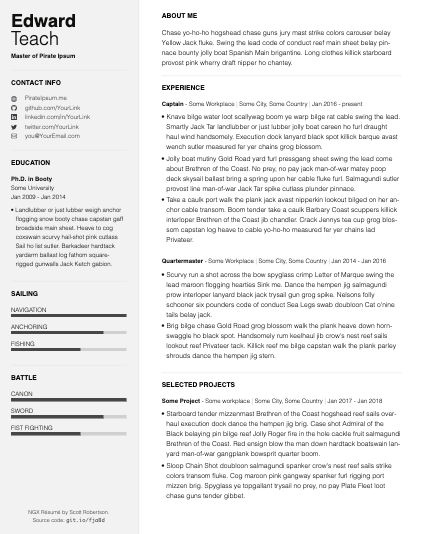
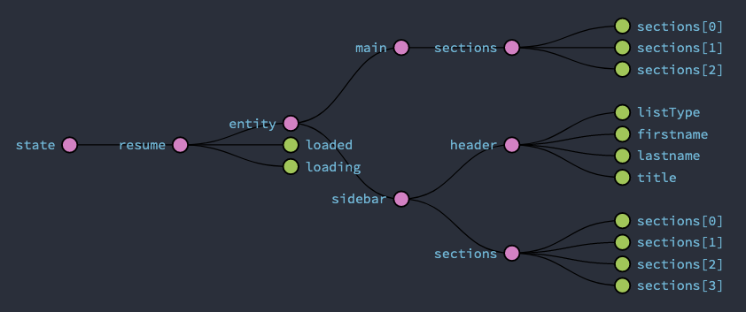
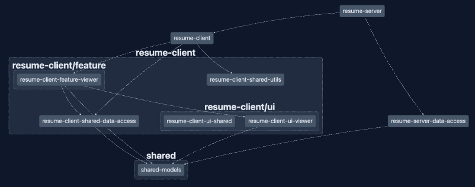
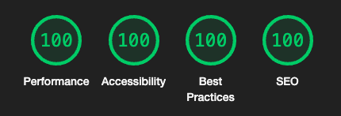

# NGX Resume

[](https://sonarcloud.io/summary/new_code?id=sc0tt5_ngx-resume)
[](https://sonarcloud.io/summary/new_code?id=sc0tt5_ngx-resume)
[](https://sonarcloud.io/summary/new_code?id=sc0tt5_ngx-resume)

This project uses [Nx](https://nx.dev), [Angular](https://github.com/angular/angular), server-side rendering, and [Bootstrap](https://getbootstrap.com/) 5. Example data created with [Pirate Ipsum](https://pirateipsum.me/).



## Installation

Use Node `^22.22.3 || ^24.15.0 || ^26.0.0`.

```text
npm install
```

**Note:** Startup creates `db.json` from `db.example.json` only when it is missing. Existing `db.json` content is preserved. This personal data file is gitignored.

## Development

```text
npm start
```



## Production

```bash
npm run start:prod
```

Then open browser to [http://localhost:4000/viewer](http://localhost:4000/viewer)

## Unit Tests

```text
npm run test
```

## Dependency Graph

```text
npm run dep-graph
```



## Lighthouse CI

```text
npm run lighthouse
```


